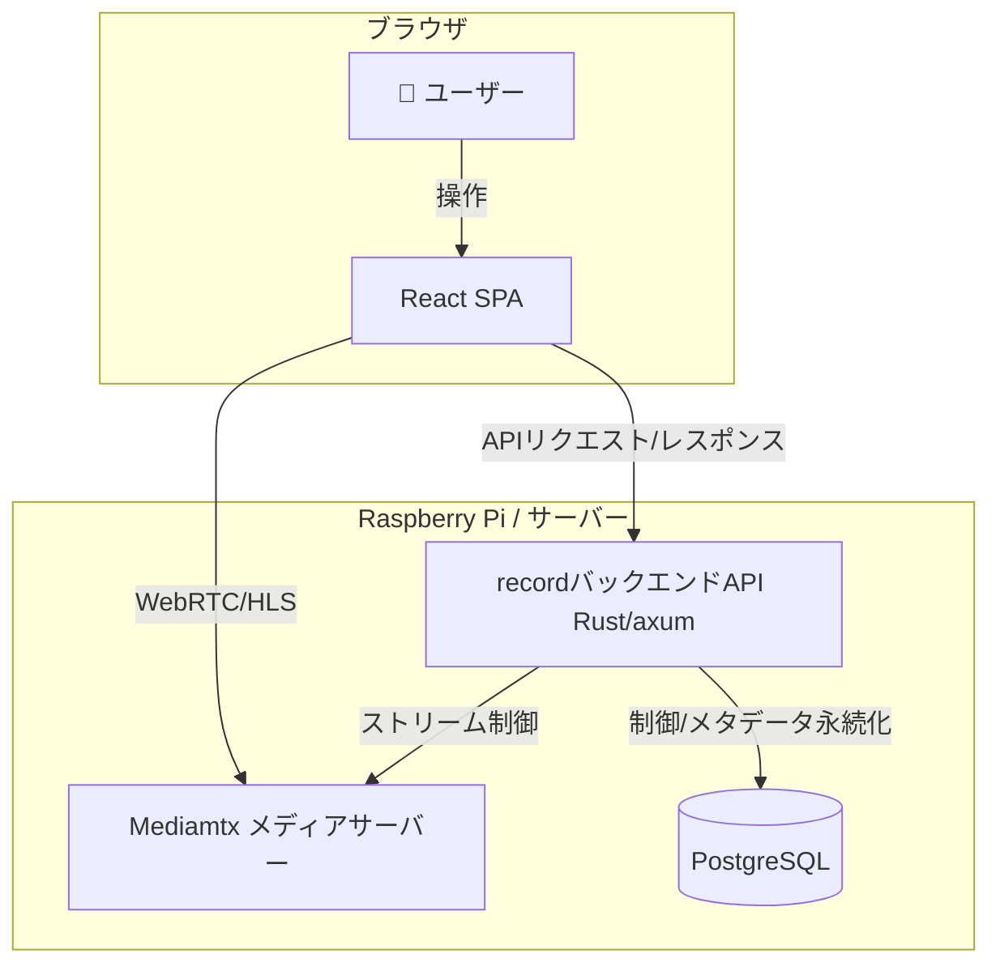
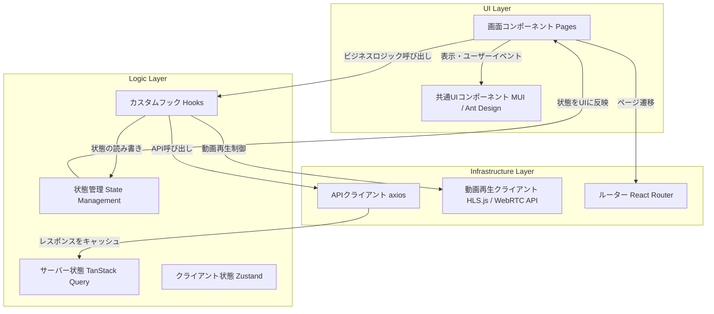
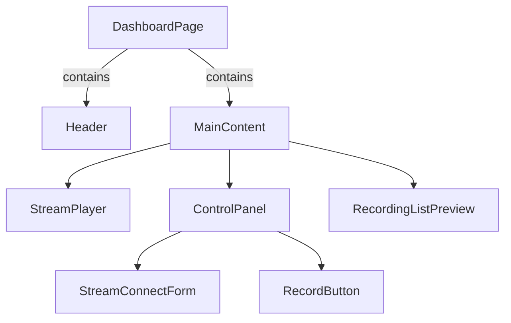
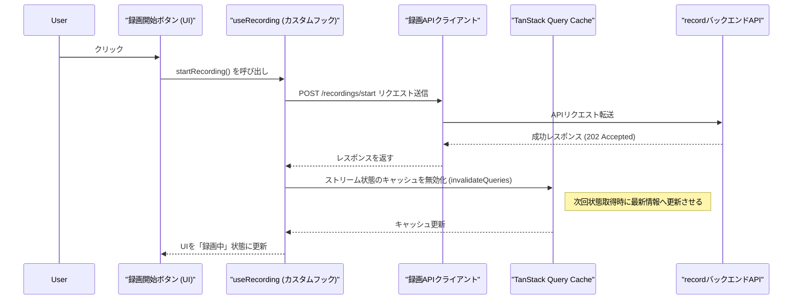

# 基本設計書（フロントエンド）

## **1\. はじめに**

### **1.1. 目的**

本ドキュメントは、EgocentricVisionプロジェクトにおける**フロントエンドアプリケーション**の基本設計を定義する。本フロントエンドは、recordバックエンドサービスと連携し、ウェアラブルカメラ等からの動画ストリームの監視、制御、および管理を行うための、リッチで直感的なWebインターフェースを提供する責務を担う。

### **1.2. 対象読者**

本アプリケーションの開発、テスト、保守、運用に関わるすべてのエンジニアを対象とする。

### **1.3. 用語定義**

| 用語             | 説明                                                                                                                        |
| ---------------- | --------------------------------------------------------------------------------------------------------------------------- |
| SPA              | Single Page Application。単一のHTMLページで動的にコンテンツを書き換えるWebアプリケーション。                                |
| サーバー状態     | バックエンドAPIから取得・更新されるデータ。非同期に扱われ、キャッシュや再同期が必要。（例：録画リスト、ストリーム接続状態） |
| クライアント状態 | UIの制御など、フロントエンド内で完結するデータ。（例：モーダルの開閉状態、フォームの入力値）                                |
| TanStack Query   | サーバー状態を管理するためのライブラリ。キャッシュ、非同期処理、状態管理を効率化する。                                      |
| Zustand          | クライアント状態を管理するための軽量なライブラリ。                                                                          |
| Vite             | 次世代フロントエンドツール。高速な開発サーバーと最適化されたビルドが特徴。                                                  |

## **2\. 設計思想と技術選定**

本フロントエンドは、以下の設計思想に基づき、モダンでスケーラブルな技術スタックを選定する。

* **宣言的UI:** Reactを採用し、状態の変化に応じてUIが自動的に更新される、見通しの良いコンポーネントを構築する。  
* **関心の分離:** 状態管理を「サーバー状態」と「クライアント状態」に明確に分離する。  
  * **サーバー状態**には**TanStack Query**を採用。API通信に伴う複雑な状態（ローディング、エラー、キャッシュ、再試行）をコンポーネントから完全に分離し、堅牢性と開発効率を向上させる。  
  * **クライアント状態**には**Zustand**を採用。Reduxのようなボイラープレートを削減し、シンプルかつ直感的に状態を管理する。  
* **コンポーネント設計:** Presentational ComponentとContainer Componentの考え方を基本としつつ、React Hooksを活用してロジックをカプセル化し、再利用性とテスト容易性を高める。  
* **開発者体験 (DX) の重視:** 高速なビルド・開発環境を提供する**Vite**と、静的型付けによる安全性を提供する**TypeScript**を全面的に採用し、生産性の向上を図る。

## **3\. アーキテクチャ**

### **3.1. システム全体構成**

本フロントエンドは、ユーザーのブラウザ上で動作するSPAとして、recordバックエンドAPIおよびMediamtxメディアサーバーと連携する。



### **3.2. フロントエンドアーキテクチャ**

アプリケーションを以下の層に分割し、責務を明確にする。



* **UI層:** ユーザーへの表示とインタラクションに責任を持つ。ビジネスロジックは含まない。  
* **Logic層:** アプリケーションのビジネスロジックと状態管理に責任を持つ。カスタムフックで再利用可能なロジックをカプセル化し、状態管理ライブラリでアプリケーション全体の状態を管理する。  
* **Infrastructure層:** 外部（API、ブラウザ機能など）との通信や連携に責任を持つ。

### **3.3. ディレクトリ構成案**

保守性と拡張性を考慮し、機能ベースのディレクトリ構成を推奨する。

```plaintext
/src  
|-- /api/           \# APIクライアントと型定義  
|-- /assets/        \# 画像、フォントなど  
|-- /components/    \# 共通UIコンポーネント  
|   |-- /common/    \# ボタン、入力フォームなど  
|   |-- /layout/    \# ヘッダー、サイドバーなど  
|-- /config/        \# 環境変数などの設定  
|-- /features/      \# 機能ごとのコンポーネント、フック、状態  
|   |-- /streaming/ \# ストリーミング関連機能  
|   |-- /recording/ \# 録画関連機能  
|-- /hooks/         \# 共通カスタムフック  
|-- /lib/           \# 外部ライブラリの設定 (axiosインスタンスなど)  
|-- /pages/         \# ルーティングに対応する画面コンポーネント  
|-- /providers/     \# アプリ全体で利用するProvider (ReactQuery, Router)  
|-- /store/         \# Zustandによる状態管理  
|-- /styles/        \# グローバルCSS、テーマ設定  
|-- /types/         \# グローバルな型定義  
|-- App.tsx         \# アプリケーションルート  
|-- main.tsx        \# アプリケーションエントリーポイント
```

## **4\. 使用技術スタック**

| 分類                 | 技術・ライブラリ               | 役割と選定理由                                                               |
| -------------------- | ------------------------------ | ---------------------------------------------------------------------------- |
| 言語                 | TypeScript                     | 静的型付けによる開発時のエラー検知とコード補完。                             |
| フレームワーク       | React                          | 豊富なエコシステムとコンポーネントベースの開発。                             |
| ビルドツール         | Vite                           | 高速な開発サーバーと最適化されたビルド。                                     |
| サーバー状態管理     | TanStack Query (React Query)   | API通信のキャッシュ、再試行、状態管理を自動化し、コードを簡潔化。            |
| クライアント状態管理 | Zustand                        | シンプルなAPIで軽量なグローバル状態管理を実現。                              |
| ルーティング         | React Router                   | SPAの標準的なルーティングライブラリ。                                        |
| UIコンポーネント     | Material-UI (MUI) / Ant Design | 高品質で一貫性のあるUIを迅速に構築。                                         |
| フォーム管理         | React Hook Form                | パフォーマンスに優れ、バリデーションが容易なフォームライブラリ。             |
| API通信              | axios                          | HTTPリクエストの送受信。インスタンス化により共通設定（認証ヘッダ等）を管理。 |
| 動画再生             | HLS.js, WebRTC API             | 各ストリーミングプロトコルに対応。                                           |
| テスト               | Vitest, React Testing Library  | Viteとの親和性が高く高速なテスト環境。ユーザー視点でのテストを推奨。         |

## **5\. 画面仕様**

主要画面とそのコンポーネント構成案を以下に示す。

### **5.1. 画面一覧**

* **ログイン画面 (/login)**: APIトークン入力  
* **ダッシュボード (/)**: 主要機能を集約したメイン画面  
  * リアルタイム再生  
  * 録画制御  
  * ストリーム接続状態表示  
* **録画一覧画面 (/recordings)**: 保存済み動画の一覧と再生、管理  
* **設定画面 (/settings)**: (将来的な拡張)

### **5.2. ダッシュボード画面 コンポーネント構成**



## **6. 主要なデータフローと状態管理**

### **6.1. シーケンス図：録画開始**

ユーザーが「録画開始」ボタンをクリックした際のデータフローを示す。



### **6.2. 状態の分離**

* **サーバー状態 (TanStack Query)**  
  * GET /api/v1/streams/status: ストリーム接続状態 (useQuery)  
  * GET /api/v1/recordings: 録画一覧 (useQuery)  
  * POST /api/v1/recordings/start: 録画開始 (useMutation)  
  * POST /api/v1/recordings/stop: 録画停止 (useMutation)  
* **クライアント状態 (Zustand)**  
  * UIテーマ (ライト/ダークモード)  
  * 通知メッセージの状態 (表示/非表示、内容)  
  * サイドバーの開閉状態

## **7\. API連携仕様**

recordサービスのAPI仕様に準拠する。APIクライアントはaxiosを用いて実装し、以下の共通処理を実装する。

* **ベースURL:** 環境変数から設定  
* **認証:** APIトークンをリクエストヘッダーに付与するインターセプターを実装  
* **エラーハンドリング:** HTTPステータスコードに応じた共通エラー処理を実装

// /src/lib/axios.ts の実装イメージ  
```javascript
import axios from 'axios';

const apiClient \= axios.create({  
  baseURL: import.meta.env.VITE\_API\_BASE\_URL,  
});

apiClient.interceptors.request.use(config \=\> {  
  const token \= localStorage.getItem('api\_token'); // or from state management  
  if (token) {  
    config.headers.Authorization \= \`Bearer ${token}\`;  
  }  
  return config;  
});
```

## **8\. 非機能要件**

### **8.1. パフォーマンス**

* **Core Web Vitals:** LCP 2.5秒未満、FID 100ms未満、CLS 0.1未満を目標とする。  
* **最適化:** ViteによるTree Shaking、コード分割 (Code Splitting) を活用し、初期ロード時のバンドルサイズを最小化する。

### **8.2. セキュリティ**

* **認証:** APIトークンは、HttpOnly Cookieが利用できないSPAの制約上、localStorage に保存する。ただし、XSS対策を徹底する。  
* **XSS対策:** Reactによる自動エスケープに加え、dangerouslySetInnerHTML は原則使用しない。  
* **CSRF対策:** バックエンドがExpect-CTヘッダーなどで対策することを前提とする。

### **8.3. テスト戦略**

* **ユニットテスト:** カスタムフックやユーティリティ関数など、純粋なロジックを対象とする。  
* **結合テスト:** React Testing Library を用い、複数のコンポーネントが連携する機能（フォーム入力から送信までなど）をユーザー視点でテストする。API部分はモック化する。  
* **E2Eテスト:** (任意) Playwright や Cypress を用い、主要なユーザーストーリー（ログインから録画開始までなど）を実際のブラウザでテストする。

### **8.4. 開発・運用**

* **CI/CD:** GitHub Actionsなどを利用し、プルリクエストごとに自動でテスト、リンター、ビルドが実行されるパイプラインを構築する。  
* **コンテナ化:** Dockerfile を用意し、本番環境へのデプロイを容易にする。マルチステージビルドを活用し、最終的なイメージサイズを削減する。