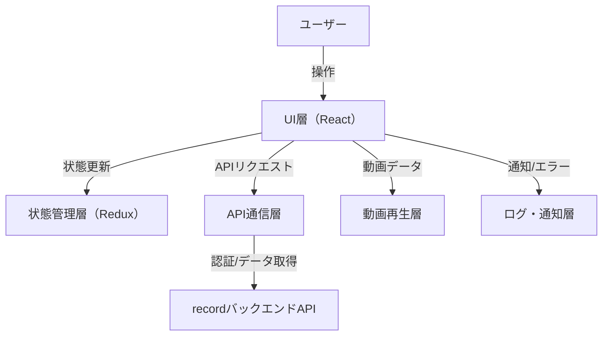

# 基本設計書（フロントエンド）

## 1. システム構成

- Webブラウザで動作するSPA（Single Page Application）
- recordバックエンドAPI（REST/WebSocket等）との通信
- 動画ストリームのリアルタイム再生・録画制御・保存動画再生・設定管理
- APIトークン認証によるセキュリティ
- フレームワークはReactを使用

## 2. アーキテクチャ概要

- UI層（React）
- 状態管理層（Redux等）
- API通信層（axios/fetch等）
- 動画再生層（hls.js/video.js/WebRTC API等）
- 認証・認可層
- ログ・通知層

### 2.1 アーキテクチャ図（mermaid）

## 3. 画面設計（主要画面）

- ログイン画面（APIトークン入力）
- ストリーム接続・切断画面
- リアルタイム再生画面
- 録画制御画面
- 保存済み動画一覧・再生画面
- 接続設定管理画面
- ステータス・ログ表示画面

## 4. モジュール設計

### 4.1 UIモジュール

- 各種画面コンポーネント（ストリーム操作、録画、再生、設定、ログイン等）
- レスポンシブデザイン対応

### 4.2 状態管理モジュール

- ストリーム状態、録画状態、ユーザー情報、設定情報等の集中管理（Redux）

### 4.3 API通信モジュール

- recordバックエンドAPIとの通信（認証、ストリーム制御、録画、動画取得、設定管理等）

### 4.4 動画再生モジュール

- ライブストリーム・保存動画の再生（HLS/WebRTC/MP4等対応）
- シーク、一時停止、再開、全画面表示

### 4.5 認証・認可モジュール

- APIトークン管理
- 未認証時の画面制御

### 4.6 ログ・通知モジュール

- 操作ログ、エラー通知、状態変化のユーザー通知

## 5. データフロー

1. ユーザーがログインしAPIトークンを入力
2. ストリーム接続要求を送信
3. バックエンドからストリーム受信、リアルタイム再生
4. 録画開始/停止要求を送信
5. 保存済み動画一覧取得・再生
6. 設定情報の取得・更新

## 6. API設計（例）

- `POST /streams/connect` … ストリーム接続
- `POST /streams/disconnect` … 切断
- `GET /streams/live` … ライブ配信取得
- `POST /recordings/start` … 録画開始
- `POST /recordings/stop` … 録画停止
- `GET /videos` … 保存済み動画一覧取得
- `GET /videos/{id}` … 保存済み動画再生
- `GET /settings` / `PUT /settings` … 設定取得・更新
- `GET /health` … ヘルスチェック

## 7. 使用技術・ライブラリ

- フレームワーク: React
- UI: Material-UI, Ant Design等
- 動画再生: hls.js, video.js, WebRTC API等
- 状態管理: Redux
- API通信: axios, fetch
- 認証: JWT, OAuth等

## 8. セキュリティ設計

- APIトークン認証
- 入力値バリデーション
- アクセス制御
- セッション管理
- XSS/CSRF対策

## 9. 拡張性・保守性

- 機能追加やUI拡張が容易なコンポーネント設計
- バックエンドAPI仕様変更への柔軟な対応
- モジュール分割・テスト容易性の確保
