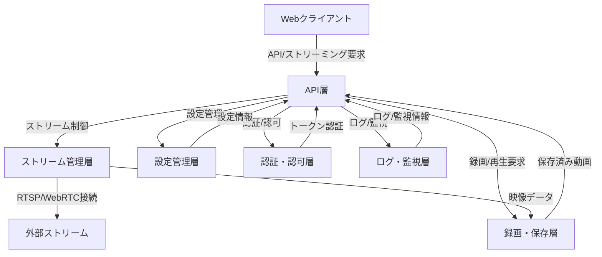

# 設計書

## 1. システム構成

- Rust製バックエンドサービス
- RTSP/WebRTCストリーム受信・配信
- 録画・保存済み動画の管理
- RESTful/gRPC API
- 設定管理・永続化
- Webクライアント（想定）

## 2. アーキテクチャ概要

- API層（actix-web/axum/warp等）
- ストリーム管理層（gstreamer-rs/ffmpeg-rs/webrtc-rs）
- 録画・保存層（ファイルI/O、ストレージ管理）
- 設定管理層（YAML）
- 認証・認可層（トークン認証等）
- ログ・監視層

## 2.1 アーキテクチャ図（mermaid）

## 3. モジュール設計

### 3.1 APIモジュール

- ストリーム接続/切断API
- リアルタイム配信API（WebSocket/HTTPストリーミング）
- 録画制御API（開始/停止/保存先指定）
- 保存済み動画再生API（シーク/一時停止/再開）
- 設定管理API（取得/更新）

### 3.2 ストリーム管理モジュール

- RTSP/WebRTC接続管理
- ストリーム受信・バッファリング
- ストリーム配信（WebSocket/HLS等）

### 3.3 録画・保存モジュール

- ストリームデータのファイル保存（mp4）
- 保存先ディレクトリ・ファイル名管理
- 保存済み動画の読み出し・配信

### 3.4 設定管理モジュール

- 接続先URL/認証情報/パラメータの管理
- 設定情報の永続化（YAML）

### 3.5 認証・認可モジュール

- APIトークン認証
- アクセス制御

### 3.6 ログ・監視モジュール

- ログ出力（アクセス/エラー/操作履歴）
- 監視用エンドポイント（/health等）

## 4. データフロー

1. クライアントがAPI経由でストリーム接続要求
2. ストリーム管理モジュールがRTSP/WebRTC接続
3. 受信データをリアルタイム配信・録画
4. 録画データは保存モジュールでファイル化
5. 保存済み動画はAPI経由で配信・再生制御

## 5. API設計（例）

- `POST /streams/connect` … ストリーム接続
- `POST /streams/disconnect` … 切断
- `GET /streams/live` … ライブ配信
- `POST /recordings/start` … 録画開始
- `POST /recordings/stop` … 録画停止
- `GET /videos/{id}` … 保存済み動画再生
- `GET /settings` / `PUT /settings` … 設定取得・更新
- `GET /health` … ヘルスチェック

## 6. 使用技術・ライブラリ

- Rust
- actix-web/axum/warp
- gstreamer-rs/ffmpeg-rs
- webrtc-rs
- YAML
- Docker

## 7. セキュリティ設計

- APIトークン認証
- 入出力バリデーション
- アクセス制御

## 8. 拡張性・保守性

- モジュール分割
- 新規プロトコル/フォーマット追加容易
- 設定管理の抽象化
